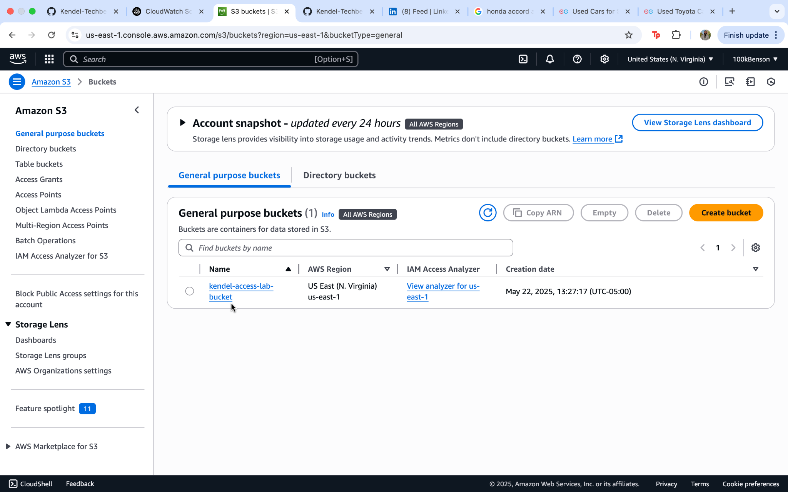
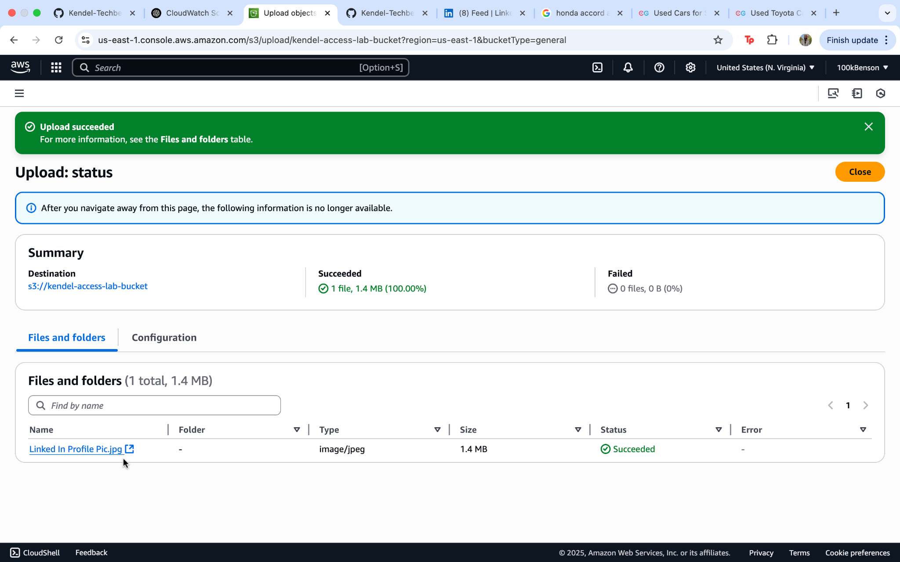
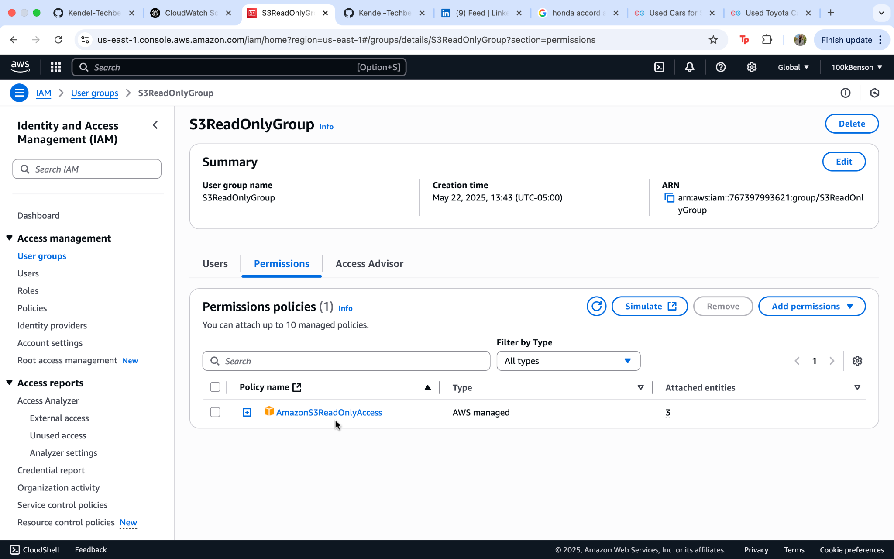
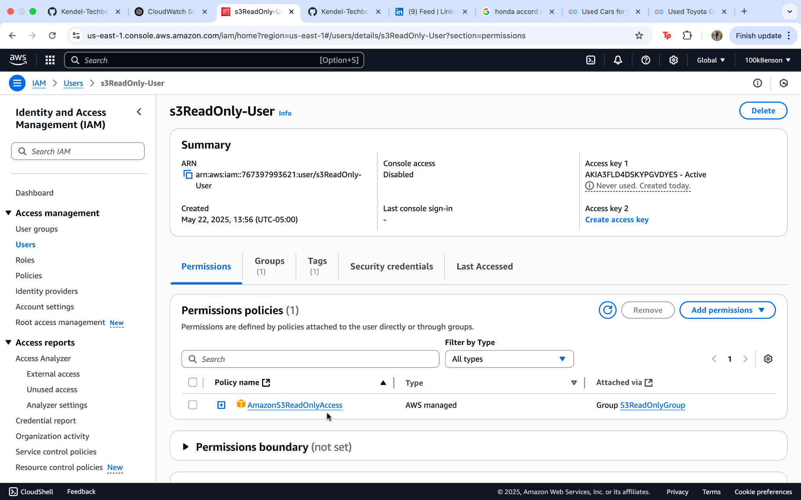
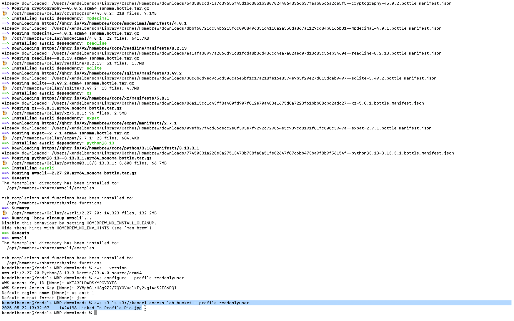
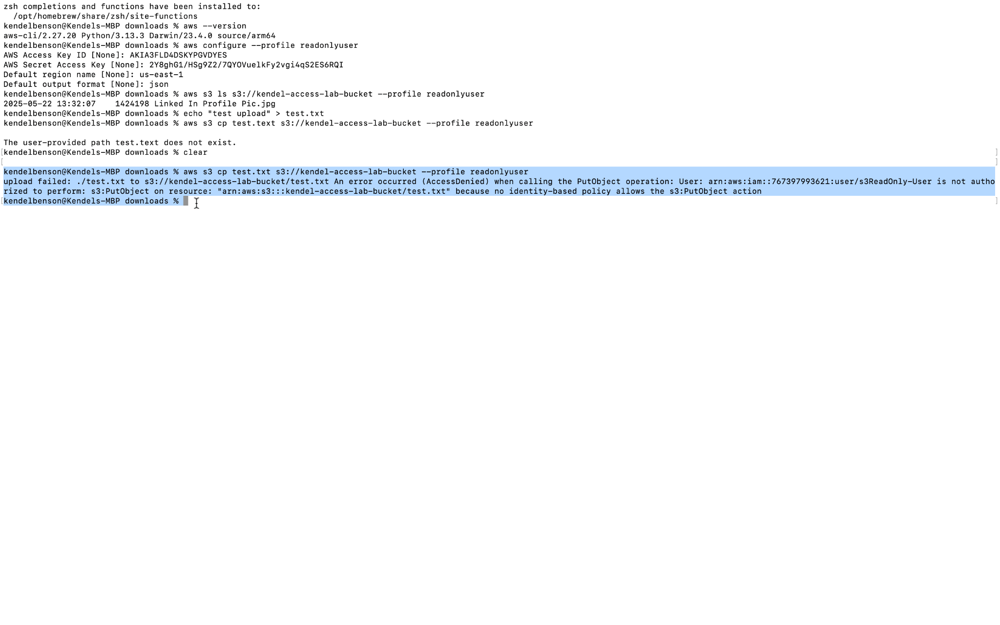

# AWS IAM + S3 Access Control Lab

This lab demonstrates how to control access to an S3 bucket using AWS IAM users, groups, and permissions. The goal is to ensure proper access restrictions using a read-only policy and test them with AWS CLI.

---

## 🚀 What I Did

### 1. Created an S3 Bucket
- Created a private bucket named `kendel-access-lab-bucket`
- Uploaded a test file to validate access

### 2. Created IAM Group
- Group Name: `S3ReadOnlyGroup`
- Attached AWS managed policy: `AmazonS3ReadOnlyAccess`

### 3. Created IAM User
- Username: `s3ReadOnly-User`
- Assigned programmatic access only
- Added user to the `S3ReadOnlyGroup`

### 4. Tested Permissions Using AWS CLI
- Configured a profile using `aws configure --profile readonlyuser`
- ✅ Successfully listed contents of the bucket
- ❌ Upload was denied due to read-only permissions

---

## 🖼️ Screenshots

### 1. S3 Bucket Created

### 2. S3 File Uploaded

### 3. IAM Group Created

### 4. IAM User Created

### 5. CLI: Read Access Allowed

### 6. CLI: Upload Denied

---

## 🧠 Skills Demonstrated
- IAM user/group creation and permissions
- S3 bucket access management
- AWS CLI usage for access verification
- Basic security best practices in AWS

---

## 📫 Notifications
This lab proves effective identity and resource access management using only AWS native services.
